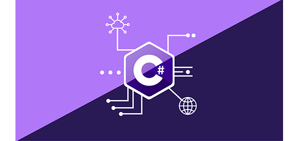
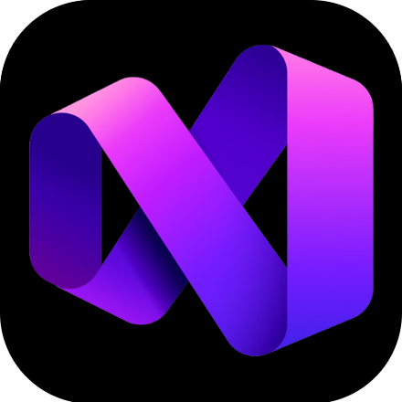

# Preference

### OpanAI / Gemini / Google Map / C# / MAUI / Visua Studio / AntiGravity / VSCode/ 秀丸

  

         

# Languages

<!-- a href="https://etherscan.io/address/0xe067433833636d2a5acbb42a219c7a97651e63bd#code"></！a>

<a href="https://ja.wikipedia.org/wiki/PlayMemories"></a -->

# Visual Studio Code

   
   

# Antigravity / Kiro / VSCode

  

  

# Hidemaru Editor Conversation AI

<!--  -->

<!-- 

 -->
<!--   -->

# Hidemaru Editor Language

# Hidemaru Editor Preview

