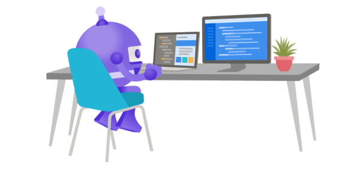
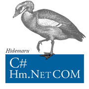

### OpanAI / Gemini / Google Map API / C# / Unity / MAUI / Ethereum  / VSCode/ 秀丸

  

# Preference

# Visual Studio Code

|    |  |
|-------|-------|
|  |  |
|  

 | 
-
 |
|  | - |

# Conversation AI

# Hidemaru Editor Language

# Hidemaru Editor Live View

